# TP 3D COMPUTER VISION

3D computer vision scripts are attached to this repository, from camera calibration, homography calculation using different tools, mosaic development and triangulation.
## Description

This project is fully developed in matlab and using the calib tool
### Dependencies

* Matlab, Calibration toolbox (caltech).
*  Visual studio Code(Optional)

### Installing
```
git clone https://github.com/GroverAruquipa/3D_Computer_m2
```

## Calibration
```
Folder TP1
```
* The calibration parameters with an Iphone 13 are:

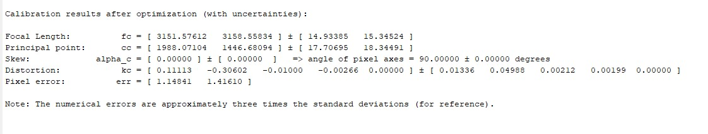
* Test of the Calibration

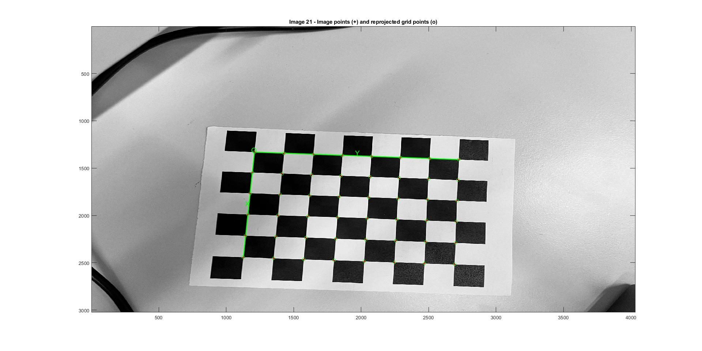

## Homography
```
Folder TP2
```
* Best Homography Scenes
<p float="left">
  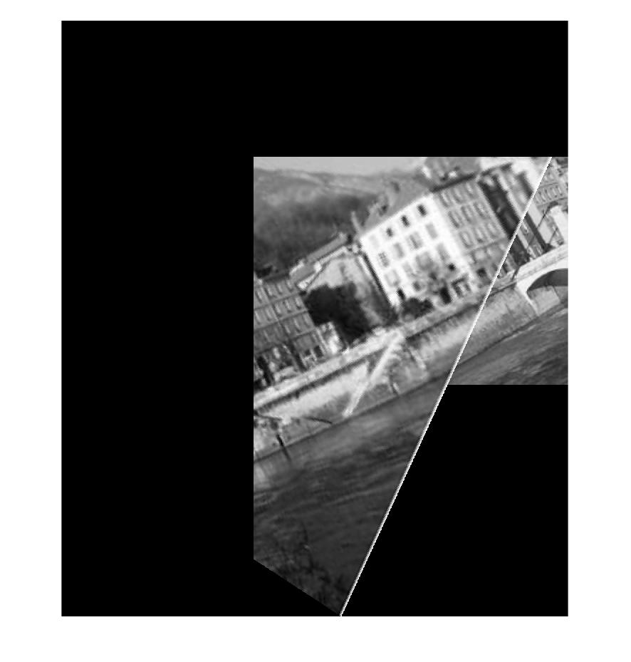
  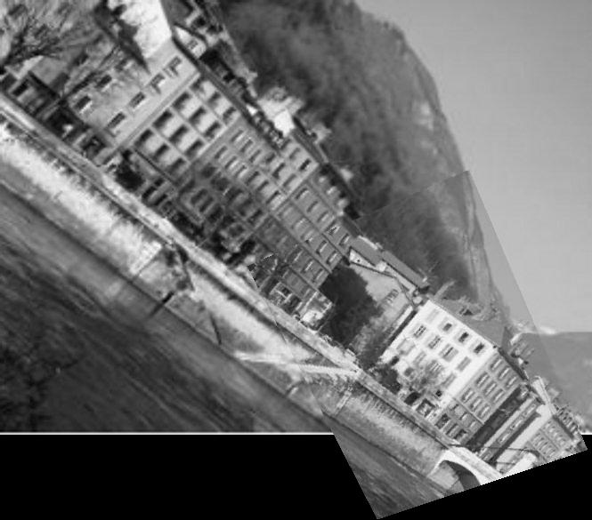 
</p>
* Homography Campus
<p float="left">
  
  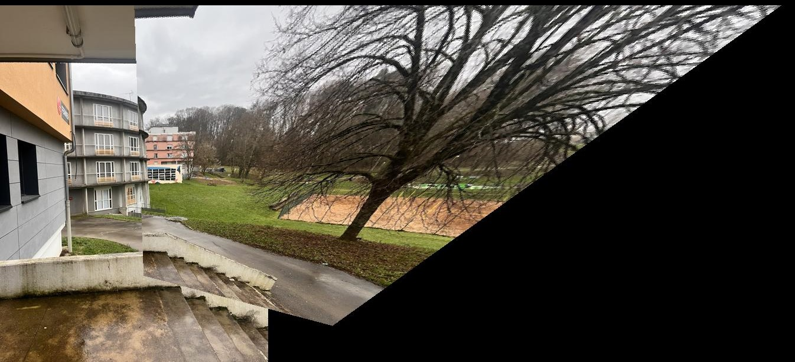 
</p>
* Rectification
<p float="left">
  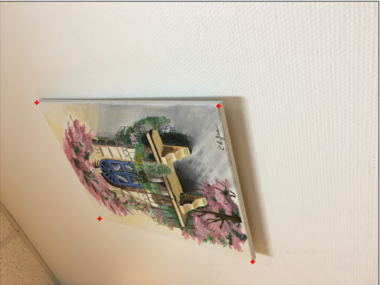
  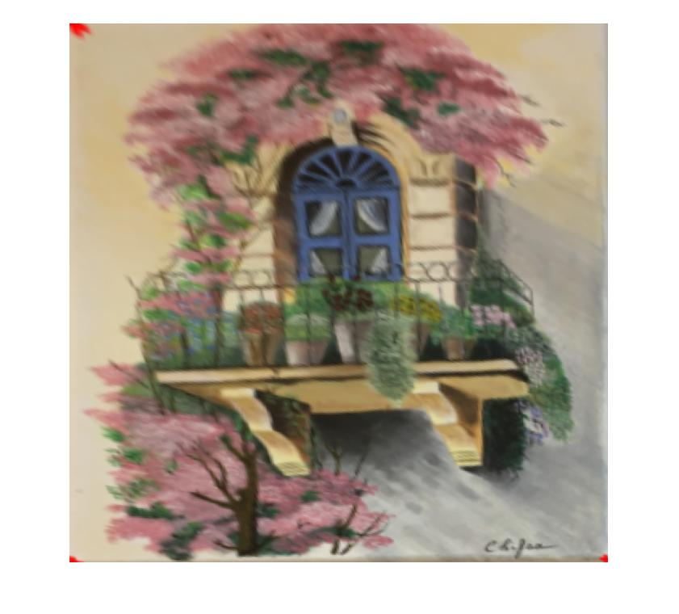 
</p>

* Inctrustation
<p float="left">
  
   
</p>

## Triangulation
* Points Extraction
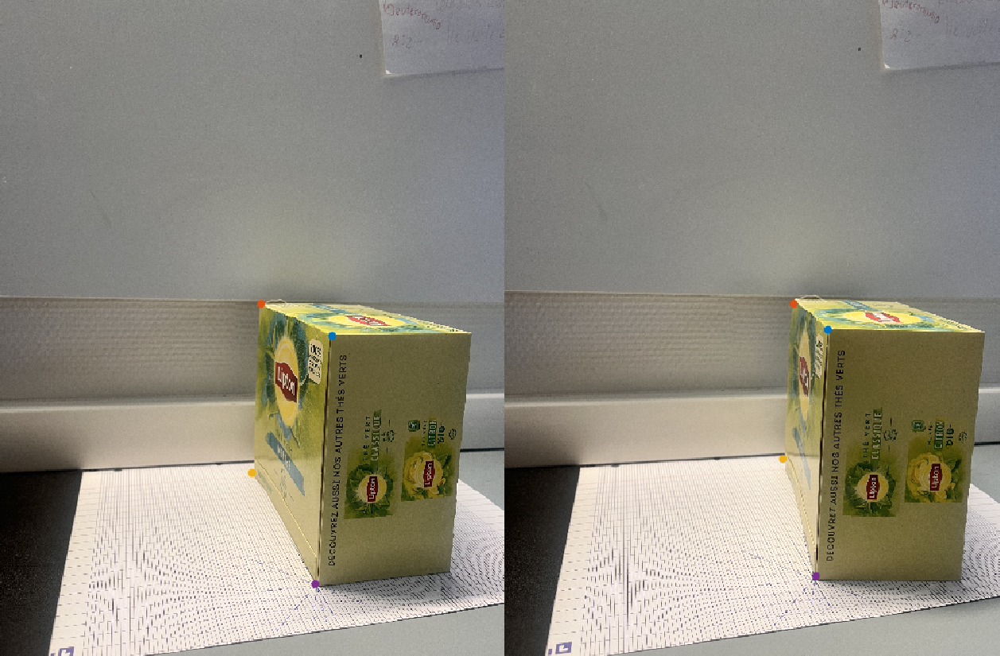
* Points traingulation and plane Extraction
<p float="left">
  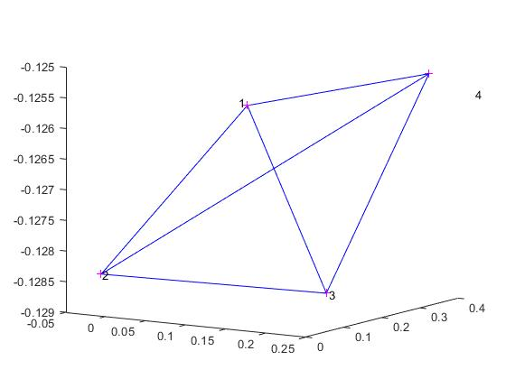
  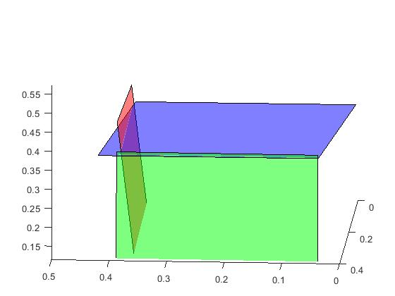 
</p>
* Plane Reconstruction
<p float="left">
  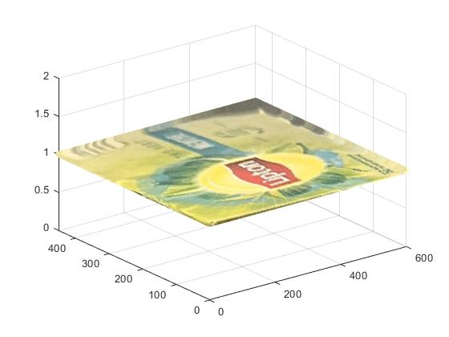
  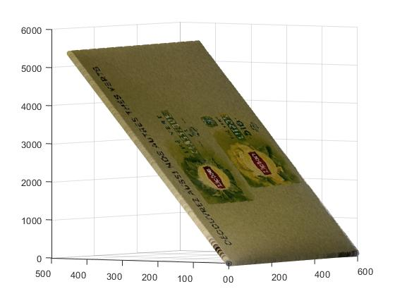 
  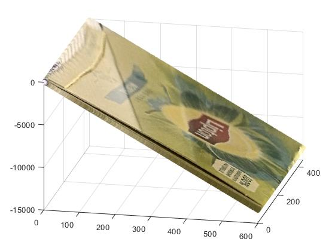 
</p>

```
Folder TP3
```
## EXTRA

Link to the report written with Latex.

```
git clone https://github.com/GroverAruquipa/CV3D_Report_Latex
```
## Authors

Contributors names and contact info and any advise for common problems or issues.

[@GroverAruquipa](https://groveraruquipa.github.io/)


## Acknowledgments
